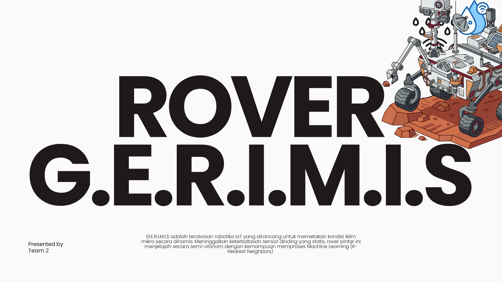
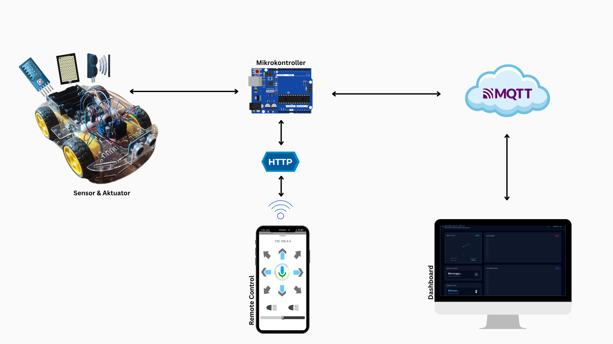
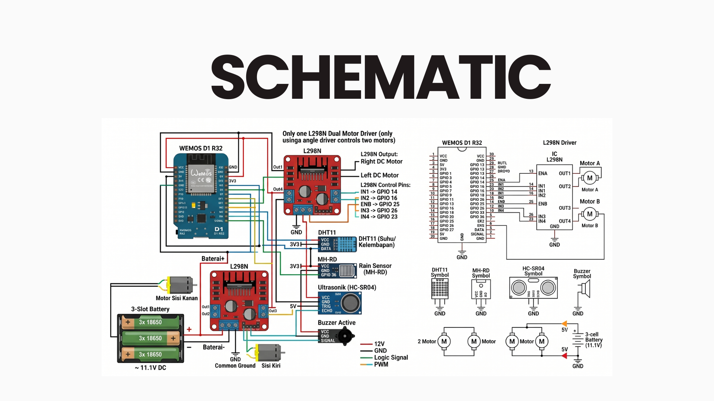

  
# 🚙 Smart Rover G.E.R.I.M.I.S
**Navigational Rover**

*Membawa Kecerdasan Buatan (AI) ke Ujung Ekosistem (Edge) melalui Mikrokontroler*

 

## 🌟 Tentang Proyek

**Smart Rover G.E.R.I.M.I.S** adalah proyek sistem robotik cerdas berbasis ESP32 yang dirancang untuk melakukan navigasi secara otonom sembari memantau kondisi lingkungan secara *real-time*. 

Keunikan proyek ini adalah implementasi algoritma **K-Nearest Neighbors (KNN)** secara *native* langsung di dalam mikrokontroler, Robot ini dapat memprediksi tingkat bahaya lingkungan berdasarkan korelasi antara Suhu dan Kelembapan Udara (Normal, Peringatan, atau Kritis). Seluruh data dari rover dikirimkan secara nirkabel melalui protokol **MQTT** ke Dashboard.

---

## ✨ Fitur Utama

- 🧠 **Native (KNN):** Prediksi kondisi lingkungan cerdas tertanam di ESP32.
- 📡 **Telemetry via MQTT:** Transmisi data ringan dan *real-time* ke sistem *cloud* (Shiftr.io).
- 🏎️ **Obstacle Avoidance:** Sensor ultrasonik untuk bermanuver menghindari rintangan secara otomatis.
- 🌡️ **Environmental Sensing:** Pembacaan Suhu, Kelembapan (DHT11), dan Sensor Hujan.
- 💻 **Real-time Web Dashboard:** UI/UX interaktif berbasis Node.js dan TailwindCSS dengan Socket.io.

---

## 📸 Workflow & Arsitektur

Berikut adalah gambaran arsitektur sistem dan alur kerja (workflow) dari Smart Rover G.E.R.I.M.I.S:

  
  
<em>Gambar 1: Arsitektur dan Integrasi Sistem</em>

 

  
  
<em>Gambar 2: Alur Komunikasi MQTT & Dashboard</em>

 

  
  
<em>Gambar 3: Implementasi Hardware & Pengujian</em>

---

## 🛠️ Teknologi yang Digunakan

### Hardware ⚙️
- **ESP32 Dev Board** (Otak Utama)
- **L298N Motor Driver** & DC Motors (Penggerak)
- **DHT11 Sensor** (Suhu & Kelembapan)
- **Rain Sensor** (Deteksi Cuaca Hujan)
- **HC-SR04 Ultrasonic Sensor** (Navigasi)

### Software 💻
- **Firmware:** C++ (Arduino IDE), PubSubClient (MQTT)
- **Backend Dashboard:** Node.js, Express.js, Socket.io
- **Frontend Dashboard:** HTML, Vanilla JS, TailwindCSS V4
- **Broker:** Shiftr.io Cloud MQTT

---

  
**Dibuat dengan ❤️ oleh Smart Rover G.E.R.I.M.I.S**

